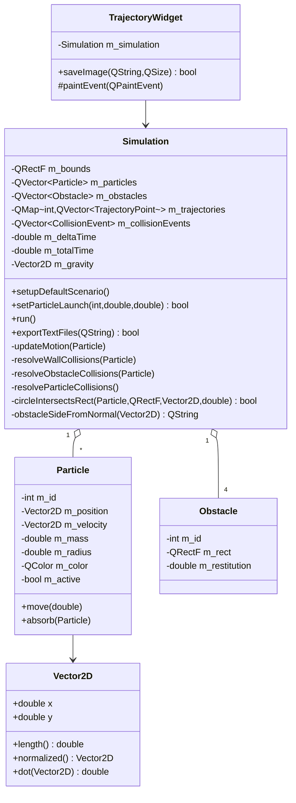

# Diagrama de clases - Actividad 1

```mermaid
classDiagram
    class Vector2D {
        +double x
        +double y
        +length() double
        +normalized() Vector2D
        +dot(Vector2D) double
    }

    class Particle {
        -int m_id
        -Vector2D m_position
        -Vector2D m_velocity
        -double m_mass
        -double m_radius
        -QColor m_color
        -bool m_active
        +move(double)
        +absorb(Particle)
    }

    class Obstacle {
        -int m_id
        -QRectF m_rect
        -double m_restitution
    }

    class Simulation {
        -QRectF m_bounds
        -QVector~Particle~ m_particles
        -QVector~Obstacle~ m_obstacles
        -QMap~int,QVector~TrajectoryPoint~~ m_trajectories
        -QVector~CollisionEvent~ m_collisionEvents
        -double m_deltaTime
        -double m_totalTime
        -Vector2D m_gravity
        +setupDefaultScenario()
        +setParticleLaunch(int,double,double) bool
        +run()
        +exportTextFiles(QString) bool
        -updateMotion(Particle)
        -resolveWallCollisions(Particle)
        -resolveObstacleCollisions(Particle)
        -resolveParticleCollisions()
        -circleIntersectsRect(Particle,QRectF,Vector2D,double) bool
        -obstacleSideFromNormal(Vector2D) QString
    }

    class TrajectoryWidget {
        -Simulation m_simulation
        +saveImage(QString,QSize) bool
        #paintEvent(QPaintEvent)
    }

    Simulation "1" o-- "*" Particle
    Simulation "1" o-- "4" Obstacle
    Particle --> Vector2D
    TrajectoryWidget --> Simulation
```
